# Ozon E-CUP: прогноз GMV клиента на 30 дней вперёд

Предсказать суммарный GMV каждого из 250000 клиентов за `2026-02-14 … 2026-03-15`
по подневной истории `2025-01-01 … 2026-02-13`. Метрика - RMSLE на `log1p`,
клиенты разделены на публичную и приватную части в отношении 20 к 80.

| | RMSLE |
|---|---|
| наивный бейзлайн организаторов (`prev30` как есть) | 2,19506 |
| **лучшее решение `stack_v23_dir`** | **1,6452202009** |

Репозиторий воспроизводит финальный сабмит, на вход
подаётся `train.parquet`, вывод CSV. 

```
python run.py --data train.parquet --cached --target stack_v23_dir   # минуты, из кеша
python run.py --data train.parquet --train  --target stack_v23_dir   # часы, GPU
```

---

## Оглавление

1. [Задача и метрика](#1-задача-и-метрика)
2. [Запуск](#2-запуск)
3. [Данные](#3-данные)
4. [Что из данных следует для решения](#4-что-из-данных-следует-для-решения)
5. [Устройство решения](#5-устройство-решения)
6. [Компоненты](#6-компоненты)
7. [Что мы проверяли](#7-что-мы-проверяли)
8. [Почему финал - лестница, а не бленд](#8-почему-финал--лестница-а-не-бленд)
9. [Точность воспроизведения](#9-точность-воспроизведения)
10. [Состав репозитория](#10-состав-репозитория)

---

## 1. Задача и метрика

Метрика определяет оптимальный ответ однозначно. Минимум RMSLE достигается на

```
ŷ = expm1( E[ log1p(Y) | x ] )
```

то есть на условном среднем логарифма, а не самой величины. При тяжёлом хвосте
оно лежит значительно ниже среднего GMV, поэтому осторожные на вид числа в прогнозе
как раз правильны. Из этого следуют два практических вывода, на которых стоит всё
решение:

* Суммировать средние по дням и логарифмировать после нельзя. Разрыв Йенсена
  измерен и равен 1,0906 в лог-шкале: наивная сборка даёт 2,48051 там, где
  правильная - 1,75495.
* Дисперсия прогноза в метрику не входит вовсе. Поэтому вероятностное
  моделирование траектории (MDN, потоки, SDE, апостериорная дисперсия) не
  пробовалось намеренно: оно отвечает на вопрос, которого метрика не задаёт.

---

## 2. Запуск

```
run.py --data DATA [--cached] [--train] [--target TARGET] [--out OUT]
```

Два режима:

* `--cached` - готовые векторы из `vectors/`: 7 `.npy` для проб, 26 компонент
  базиса опоры, 5 проб со своими скриптами. Прогон занимает минуты.
* `--train` - всё обучается здесь же: 21 скрипт компонент базиса
  (`data/basis_plan.json`) и 8 скриптов векторов для проб
  (`data/train_plan.json`). GPU, часы. Побитового совпадения не будет: предел
  воспроизводимости между машинами - corr 0,9956 при одном сиде и одной версии
  LightGBM.

Без флага скрипт ничего не делает и говорит, какой выбрать. Пути к векторам, кэшу
панелей и таблицам замеров заданы относительно пакета; нулевая точка лестницы
(`stack_v12`) собирается солвером и параметром не является.

`--target` принимает `stack_v23_dir` (финал) или `stack_v13` (короткая ветка,
одна ступень от опоры).

### Замеры лидерборда - что такое лб-пробинг и почему он тут использовался

ЛБ-пробинг это популярная техника извлечения информации из тестовых данных на публичном ЛБ.
`data/lookup.tsv` содержит 19 чисел: публичные скоры ступеней и проб лестницы.

Замеры компонент базиса (`data/basis_scores.tsv`, 26 строк) нужны солверу для решения
`k_j = (Var_L + Var(P_j) − R_j²)/2`

---

## 3. Данные

30 631 006 строк, 18 колонок, 250 000 клиентов, 409 дней. Детализации по товарам или
категориям нет - только подённые агрегаты, поэтому потолок признакового пространства
задан жёстко: всё, что можно построить, строится из одиннадцати подённых каналов.

| колонка | что это |
|---|---|
| `search`, `cat` | флаги пользования Поиском и Каталогом |
| `has_search_to_cart`, `has_cat_to_cart`, `has_search_to_ord`, `has_cat_to_ord` | флаги переноса в корзину и покупки по каналам |
| `search_to_cart`, `cat_to_cart` | товаров в корзину по каналам |
| `search_to_ord`, `cat_to_ord` | товаров куплено по каналам |
| `to_cart`, `to_ord` | суммарные счётчики |
| `gmv_search`, `gmv_cat`, `gmv` | стоимость купленного по каналам и всего |
| `searches` | число поисковых запросов |

Тождество `gmv = gmv_search + gmv_cat` выполняется точно на всех 30,6 млн строк.
Воронка за всю историю: 98,5 млн поисков -> 31,9 млн товаров в корзину (32,4%) ->
8,1 млн куплено (25,2%). Конверсии устойчивы во времени: на окне последних 30 дней
те же с точностью до процента.

Всё, что показано ниже про цель, измерено на локальном якоре 378 (2026-01-14) с
горизонтом 30 дней - точной копии боевой постановки. Настоящее целевое окно в
обучающих данных отсутствует.

### Цель: почти половина клиентов не купит ничего

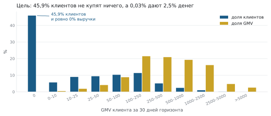

45,9% клиентов дают ровно ноль. На другом конце 63 клиента с GMV выше 5000 - это
0,025% людей и 2,5% всех денег. Отсюда обязательная структура головы: **гейт на нули
и распределение на величину**, а не одна регрессия.

### Концентрация: хвост и решает метрику

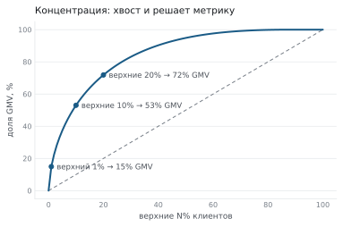

Верхний 1% клиентов даёт 14,9% GMV, верхние 10% - больше половины, верхние 20% -
почти три четверти. Нижняя половина клиентов - 5,2%.

### 409 дней истории

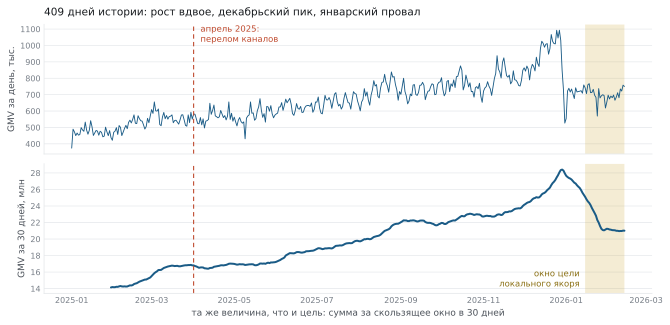

Верхняя панель - подённый GMV, нижняя - сумма за скользящее окно в 30 дней, то есть
ровно та величина, которую требуется предсказать. Две панели, а не две шкалы на одной
оси: величины различаются в тридцать раз.

Виден декабрьский пик и январский провал. Это ловушка для калибровки:
**январское окно - единственный сезонный провал года**, и аффинная поправка,
подобранная на якоре 378, применённая к финальному якорю, ухудшает результат на
0,0067. Правило "валидация не пригодна для калибровки" подтверждено шесть раз за всю работу.

### Рост идёт числом покупателей, а не величиной покупки

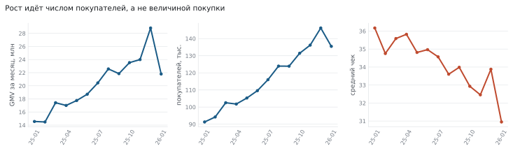

За год GMV вырос почти вдвое (14,6 -> 28,8 млн), активных клиентов 189 -> 247 тысяч, а
средний чек при этом падал: 36,17 -> 30,95. Часть этого роста - артефакт отбора
клиентов, см. ниже; но падение чека артефактом не объясняется.

**Апрель 2025 - структурный перелом каналов.** Доля каталожных заказов падает
0,0800 -> 0,0575 за месяц, средний чек каталога прыгает 37,42 -> 44,94. Дальше каналы
расходятся ножницами: чек поиска 35,9 -> 29,1, чек каталога держится около 45.
Следствие для моделей: окна длиннее одиннадцати месяцев тянут в модель докризисный
каталог, которого на тестовом окне нет.

Каталог при этом - не тип клиента, а число попыток: по децилям расходов доля каталога
почти плоская (6,1% -> 7,5%), а вероятность вообще туда зайти растёт в восемь раз
(9,7% -> 80,1%). Внутриклассовая корреляция личной доли каталога - 0,22. Поэтому
канальная декомпозиция цели (два стека или две головы) закрыта: сборка из каналов даёт
2,48 против 1,77 у прямой модели.

### Давность визита - сильнейший одиночный признак

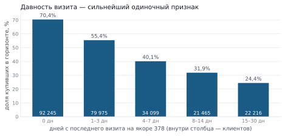

Заходивший в день якоря покупает в горизонте с вероятностью 70,4%, не заходивший
две-четыре недели - 24,4%.

### Куда переходит клиент

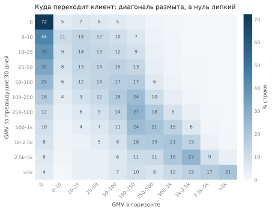

72% клиентов с нулём за предыдущие 30 дней остаются
в нуле, но каждый восьмой из тех, кто не покупал ни разу за 409 дней, всё же покупает
в следующем месяце - этот сегмент и есть самый трудный для интуитивного предсказания.

### Клиенты отобраны по активности - самая важная находка анализа данных

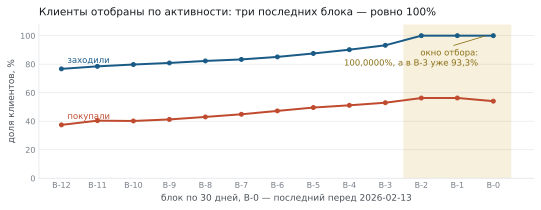

250000 клиентов отобраны не случайно: каждый активен в каждом из трёх последних
30-дневных блоков. В блоках B-0, B-1 и B-2 доля активных - ровно 100%, в B-3
уже 93,26%, дальше монотонно вниз. Такой обрыв невозможен естественным образом.

Три следствия, и все три меняют постановку:

1. **Рост в данных частично фиктивный.** Выборка сгущается к концу истории по
   построению. Число уникальных активных за месяц растёт 189k -> 247k, но 75,8% всех
   клиентов присутствуют с января 2025. Тренд нельзя брать за реальный сигнал.
2. **Валидация на последнем окне оптимистична.** Локальный якорь 378 берёт целевым
   окном `2026-01-15 … 2026-02-13` - ровно то окно, по которому шёл отбор. В нём
   активны 100% клиентов по построению.
3. **Можно измерить оптимизм валидации** Правило отбора воспроизведено на ранних
   якорях, где целевое окно свободно от отбора.

Бэктест дал мягкое смещение: на свободных якорях активность в целевом окне
97,2–98,0% вместо 100%, а уровень RMSLE стабилен по всем якорям (2,21–2,30 для
наивного правила, 1,91–2,01 для калиброванного). Значит валидацию на якоре 378
использовать можно - но ожидать в тесте на 2–3 процентных пункта больше нулей.

Остаётся открытый вопрос, который по доступным данным не решается: если
применено то же правило с учётом тестового блока, то все 250k активны и в тесте, и
валидация точна. Цена ошибки - те же 2–3 п.п. нулей.

Удержание при этом высокое и устойчивое: "активен сейчас -> активен через 30 дней" -
94,4%, "покупал -> купит" - около 73% против 20% у не покупавших.

### Недельный ритм есть, но месячная сумма его усредняет

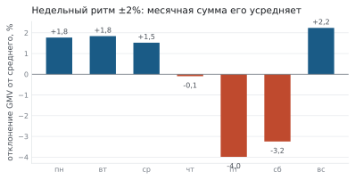

Размах по дням недели - около +-2%. Месячная сумма содержит 4,3 недели, поэтому
недельная структура в цель почти не проходит: проба по выравниванию дня недели дал
t = +0,60, то есть ноль. Механизм при этом реален и моделями не выражен вовсе, но
надёжность его оценки всего 0,085 - предпочтение клиента по дням недели нестабильно
даже между двумя половинами его собственной истории.

### Где стоят простые правила

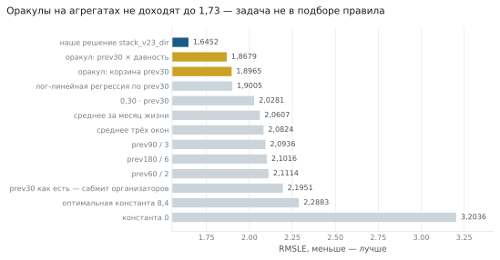

Важное здесь - не бейзлайны, а **оракулы**. Разбиение по корзинам `prev30 × давность`
с подстановкой лучшего возможного числа в каждую ячейку даёт 1,8679. Значит
на агрегатах низкой размерности задача не решается вообще: весь запас лежит в
восстановлении индивидуального клиента, а не в подборе правила.

---

## 4. Что из данных следует для решения

Пять выводов, каждый из которых оплачен экспериментом:

1. **Голова обязана быть составной.** Гейт на нули × распределение величины (ZILN).
   Смесь атома с непрерывной частью требует трёх элементов: гейта, распределения
   величины и зависимости дней. Уберёшь любой - ломается: диффузия без гейта даёт
   `P(Y>0) = 1,0000`, с независимым гейтом - 0,9822, правильно только с frailty.
2. **Предсказывать надо путь, а не сумму.** Из-за разрыва Йенсена сумма берётся
   внутри логарифма, поэтому дневная генеративная модель предсказывает на каждый день
   горизонта хазард и распределение суммы, а потом интегрирует.
3. **Вся история несёт сигнал.** Обрезка длинных окон хуже на 0,0008–0,0011. Память
   ряда затухает медленно, окно в год оправдано - при том что апрельский перелом
   ограничивает полезную длину сверху.
4. **Локальная валидация не ранжирует.** Локальный якорь стал анти-предиктором для
   дневного семейства: лучший локально `tft_all10` промахнулся сильнее всех, худший
   локально `event_multi` получил наибольший вес в стеке. Отбор без траты слота
   лидерборда невозможен.
5. **Новых сырых данных нет.** Все 18 колонок исходника лежат в панели или из неё
   выводятся. Поэтому прирост в поздней фазе искался не в признаках, а в величинах,
   которые модели структурно недоступны, - см. раздел 5.4.

---

## 5. Устройство решения

### 5.1 Три слоя

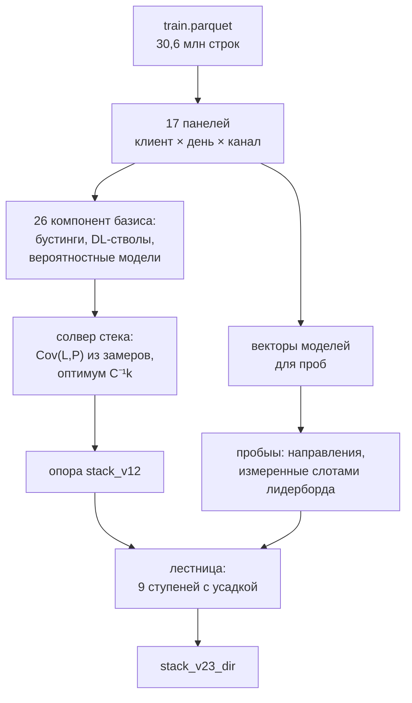

Решение не является смесью моделей. Смесь - только **опора**; всё, что выше неё,
получено движением вдоль направлений, каждое из которых измерено отдельным слотом
лидерборда и применено с усадкой по силе измерения.

### 5.2 Калибровочный аппарат

Три константы, измеренные пробами лидерборда, дальше используются как точные:

```
E[log1p Y]   = 2,3284       трёхточечная парабола сдвигов
Var(log1p Y) = 5,366802     проба наклона, переподтверждён с точностью 1,2e-5
Cov(L, P)    = (Var_L + Var(P) − R*²) / 2      ТОЧНО для любого замеренного вектора
```

Третья формула - ключ ко всему остальному. Если у вектора известен его публичный
скор, ковариация его ошибки с истиной вычисляется **точно**: истина сокращается.
Отсюда скор любой линейной смеси предсказывается заранее, без отправки:

```
R²(w) = Var_L − 2·wᵀk + wᵀCw
```

Точность этих предсказаний по ходу проекта: 2,9e-05 -> 1,0e-04 -> 6,6e-05 -> … ->
**2,8e-06**.

### 5.3 Опора: солвер стека

Оптимум без ограничений - `w = C⁻¹k`. Прямое решение вырождается: компоненты
коррелируют на 0,99+. Нужны две поправки, обе оплачены ошибками проекта.

**Поправка `k` по реестру.** Каждая уже замеренная смесь даёт точное линейное
ограничение на ошибку `k`:  `wⱼᵀδ = (R²изм − R²пред)/2`, где `wⱼ` - разложение этой
смеси по базису. Min-norm решение по всем ограничениям вычитается: `k_corr = k − δ`.
Без неё предсказание систематически оптимистично.

**Политика весов**, оплаченная провалом `stack8x` (промах +0,0016): `max|w| ≤ 0,6`,
шорты не глубже −0,25. Решение вне политики отвергается.

Два правила, важных для понимания:

* **Базис - это не отобранный список, а ВСЕ замеренные векторы.**
* **Половина DL-векторов входит с отрицательными весами.** Они работают корректорами
  шума, а не источниками сигнала: стек использует их ошибку, а не их точность.

### 5.4 Лестница направлений

Каждая ступень - это предыдущая плюс **одно** направление:

```
eps    = sqrt((R0 + 0,0015)² − R0²)      цена одного слота в единицах метрики
НУЛЬ   = sqrt(R0² + eps²)                скор пробы при нулевом эффекте
theta  = (НУЛЬ² − meas²) / (2·eps)       выводится из замера пробыа
t      = theta / SE,  SE = R0/sqrt(50000) = 0,00736
kappa  = max(0, 1 − 1/t²)                покоординатная усадка
ступень = предыдущая + kappa·theta·D
уровень = 90 шагов бисекции к E[log1p Y] = 2,3284
```

Функция выигрыша известна точно: `θ²·κ(2−κ)/(2R)`. Для прошлогоднего направления
записано `θ = 0,02149`, `κ = 0,883`, выигрыш `1,38e-04` - формула даёт `1,384e-04`.
Совпадение до четвёртой значащей цифры означает, что правило усадки можно **выводить,
а не подбирать**.

Усадка оставлена покоординатной сознательно. Объединённый вариант (общее `κ` на весь
набор при обменивающемся приоре) проверен и отклонён: ставка асимметрична против него
вдвое с лишним. Причина в том, что критерий отбора осей умеет предсказывать, какая
ось сработает - день недели и возраст клиента были предсказаны пустыми до измерения и
оказались пустыми, - а значит элементы не обменивающиеся, и пул перекачивал бы усадку
от сильных осей к заведомо нулевым.

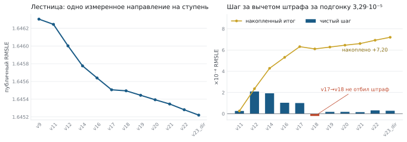

| ступень | public LB | шаг | чистый шаг | накоплено |
|---|---|---|---|---|
| `stack_v9` | 1,6463024839 | - | - | 0 |
| `stack_v11` | 1,6462436395 | +5,88e-05 | +2,59e-05 | +2,59e-05 |
| `stack_v12` | 1,6460012027 | +2,42e-04 | +2,10e-04 | +2,35e-04 |
| `stack_v14` | 1,6457757641 | +2,25e-04 | +1,93e-04 | +4,28e-04 |
| `stack_v16` | 1,6456395215 | +1,36e-04 | +1,03e-04 | +5,31e-04 |
| `stack_v17` | 1,6455060133 | +1,34e-04 | +1,01e-04 | +6,32e-04 |
| `stack_v18` | 1,6454944639 | +1,15e-05 | −2,14e-05 | +6,11e-04 |
| `stack_v19` | 1,6454440380 | +5,04e-05 | +1,75e-05 | +6,28e-04 |
| `stack_v20` | 1,6453934846 | +5,06e-05 | +1,76e-05 | +6,46e-04 |
| `stack_v21` | 1,6453455262 | +4,80e-05 | +1,51e-05 | +6,61e-04 |
| `stack_v22` | 1,6452809664 | +6,46e-05 | +3,17e-05 | +6,92e-04 |
| **`stack_v23_dir`** | **1,6452202009** | +6,08e-05 | +2,79e-05 | **+7,20e-04** |

Публичный выигрыш всей лестницы **+1,082e-03**, штраф за усадку **3,619e-04**

Формула штрафа: для `k` подогнанных параметров
`E[публ − прив] = 2·SE²·edof` в единицах `R²`, то есть `SE²/R0 = 3,290e-05` на
эффективный параметр в единицах `R`. Проверено Монте-Карло на 200 000 повторов
(1,087e-04 против теоретических 1,083e-04) и тремя независимыми измерениями.

**Порог применимости нового направления:** ожидаемый приватный выигрыш положителен при
`θ² > 2·SE²`, то есть `|t| > 1,41`. По 29 замеренным направлениям `χ² = 16,19` на 29
степенях свободы, то есть типичное `|t| < 1` - априорная вероятность, что новое
направление пройдёт порог, около **8%**.

### 5.5 ЛБ-пробинг: пять разных конструкций

Направление пробинга строится из разности двух версий модели, а не из самой компоненты.
Это первое из пяти правил кампании проб:

1. **Нужно делать пробы с разностью версий, а не компоненту** Компонента почти целиком лежит в
   том, что стек уже знает; после ортогонализации к прогнозу от неё остаётся мало.
   Разность старой и новой версии с самого начала содержит только изменившееся.
   Пример: трио компонент дало `θ = 0,0035`, разность по эпохам 0,0055, разность по
   оператору **0,0149**.
2. **Обе половины пары - из одного прогона одного скрипта** Между линиями скриптов
   обнаружен систематический сдвиг около 0,002; разность через границу линий
   содержала бы его как постороннюю компоненту.
3. **Коррелированные разности внутри семейства усреднять в одну ось** При корреляции
   0,4 вклады перекрываются почти наполовину, и зондировать каждую - переплата
   слотами. Среднее сильнее каждого член, тк общая часть складывается линейно, а
   независимый шум как корень из числа членов.
4. **Знак угадывать не нужно** У оператора `θ` отрицательное: стеку нужно движение ПРОЧЬ от
   трансформера к GRU, хотя по одиночному скору трансформер лучше и все локальные
   инструменты рекомендовали его к добавлению. Для выигрыша важен `θ²`.
5. **Коэффициент берем только из замера, не предсказываеи калибровкой** Сборка с весом компоненты из риджа дала
   результат хуже предыдущей ступени: направление было верное, сила - нет
   (применили в 4,6 раза больше `θ`).

| зонд | опора | конструкция | направление |
|---|---|---|---|
| `activity_comb` | v12 | 82 направления из 10 панелей, ридж-регрессия остатка | готовый вектор |
| `yago` | v14 | `j3_yago_probe.py` - прошлогоднее целевое окно | готовый вектор |
| `rank_shift` | v16 | `j4_dow_rank.py` - межклиентная ранговая траектория | готовый вектор |
| `cohort` | v17 | `j6_cross_time.py` - когортное направление | готовый вектор |
| `q99` | v18 | среднее двух рук квантильной головы: `p8_fusion_q99_fin`, `p8_cnn_q99_fin` | **собран, corr 0,9617** |
| `quad` | v19 | `r6_daily_quad_fin` (квадратура) − `daily_gen_q2c` (96 путей МК) | **собран, corr 0,8657** |
| `nosm` | v20 | `s4_both_fin` (VSN с сигмоидой) − `r6_daily_quad_fin` (softmax) | **собран, corr 0,8734** |
| `operator` | v21 | `w20_diff_probe.py`: `x16_ev_old_fin` против `v12_declm1_fin` | **собран, corr 0,8412** |
| `wdrift2` | v22 | `zh_purified_probes.py` - сжатие весов при переносе через время | готовый вектор |

Принцип работы каждой пробы (т.е. что мы проверяем прямо на ЛБ):

* **"компонента"** (`q99`) - операнды идут не разностью, а каждый своим слагаемым;
  направление - их среднее, ортогонализованное к `{1, q}`. Так строились зонды до
  того, как появилось правило "зондировать разность версий".
* **"ранний"** (`quad`, `nosm`) - одна сырая разность
  `(b−mean)/sd − (a−mean)/sd`, ортогонализация к `{1, q}`, нормировка,
  `eps = 0,0703` вбит константой. Уровень держится сам:
  направление средненулевое и ортогонально опоре.
* **"w20"** (`operator`) - одна разность `(b−mean) − (a−mean)`, `eps` считается
  формулой, 90 шагов бисекции к уровню.
* **"w23"** (`w23_cluster_probe` и родственные) - каждая разность нормируется отдельно, знаки
  выравниваются по первой, берётся среднее, дальше как `w20`.
* **"панели"** (`activity_comb`) - 82 направления из десяти панелей, совместная
  ридж-регрессия остатка, взвешенная сумма.

Критерий, по которому оси отбирались (уточнялся дважды по ходу): работает то, что
**не выводится из собственного вектора признаков клиента** и влияет на **месячный
итог**. Возраст клиента отдельной колонкой не лежит, но выводится из отношений окон
(`gmv_all ≈ gmv_365` означает возраст меньше года) - ноль. День недели не выводится,
но месячная сумма усредняет недельную структуру - ноль. А прошлогоднее окно не
выводится никак: этого куска истории нет ни в одном признаке. И ранг требует
сравнения с другими клиентами, тогда как модель видит одного.

---

## 6. Компоненты

### 6.1 Слой данных: 17 панелей

`server_prep.py` (7 панелей), `server_prep2.py` (5), `build_panels_rest.py` (4).
Панель - это матрица `клиент × день` на каждый из каналов.

### 6.2 Базис опоры: 26 компонент

Всё, что появилось позже `stack_v23_dir`, из базиса исключено: опора не может
опираться на собственное будущее.

Компонента названа именем своего генератора. Это имя — одно и то же в трёх местах:
файл в `components/basis/`, вектор в `vectors/basis/` и ключ в
`data/basis_scores.tsv`. Где один скрипт даёт несколько компонент, к имени добавлено,
какую именно.

| компонента | генератор |
|---|---|
| `active_bagging_test` | `d4_active_bagged.py` |
| `c5_daily_bagged` | `c5_daily_bagged.py` |
| `d7_fusion4_bagged` | `d7_fusion4_bagged.py` |
| `fx_btyd` | `fx_btyd.py` |
| `fx_final_cands` | `fx_final_cands.py` |
| `fx_segprobe` | `fx_segprobe.py` |
| `knn_funnel3` | `knn_funnel3.py` |
| `make_stack6_ols` | `make_stack6.py` |
| `make_stack_catboost` | `make_stack.py` |
| `make_stack_dl` | `make_stack.py` |
| `make_stack_neural` | `make_stack.py` |
| `p2_lb_probe` | `p2_lb_probes.py` |
| `t07_submit_btyd` | `t07_submit.py` |
| `t07_submit_lgbm_dart` | `t07_submit.py` |
| `t13_rfe_catboost` | `t13_rfe_build.py` |
| `t13_rfe_lgbm` | `t13_rfe_build.py` |
| `t15_no_calendar` | `t15_no_calendar.py` |
| `t17_tabnn_ft_transformer` | `t17_tabnn_zoo.py` |
| `t17_tabnn_tabnet` | `t17_tabnn_zoo.py` |
| `t18_heads_hazard` | `t18_heads.py` |
| `t24_evgru2` | `t24_evgru2_final.py` |
| `t26_elastic_base` | `t26_elastic_base.py` |
| `t27_evgru3` | `t27_evgru3_final.py` |
| `times_emb_28` | `t28_ts_emb_final.py` |
| `w23_cluster_probe` | `w23_cluster_probe.py` |
| `x12_replace_build` | `x12_replace_build.py` |

Публичные скоры компонент в таблице не приводятся. Из репозитория они не убраны и
убраны быть не могут: солвер считает по ним `k_j = (Var_L + Var(P_j) − R_j²)/2`, и
без `data/basis_scores.tsv` опора не собирается вовсе.

Крупнейшие веса, которые находит солвер: `t07_submit_lgbm_dart` −0,126,
`x12_replace_build` +0,105, `w23_cluster_probe` +0,101, `fx_final_cands` +0,077,
`p2_lb_probe` +0,067, `c5_daily_bagged` +0,066. Отрицательный вес у худшей по скору
компоненты — это не ошибка, а второй закон из 7.3.

### 6.3 DL-семейство

Восемь нейросетевых векторов. Их вклад в стек и взаимные корреляции:

| компонента | corr с истиной | что это |
|---|---|---|---|
| `daily_bag` | 0,70115 | дневная генеративная, 4 члена по 80% |
| `tft_all` | 0,70079 | VSN, статическое обогащение, residual stacking |
| `seq9` | 0,70018 | CNN-гибрид, 9 сидов |
| `ev_full` | 0,69986 | событийный ансамбль 32/96/182 |
| `enc_lstm` | 0,69937 | энкодер v2 + событийная LSTM |
| `evgru2` | 0,69731 | событийная GRU |
| `seq_pure` | 0,69494 | чистая CNN без табличной головы |
| `d_active` | 0,69221 | событийные часы, 4 члена |

Весь блок сидит в коридоре **взаимных корреляций 0,982–0,997**. Самая низкая пара -
`seq_pure` ↔ `d_active` (0,982): чистая свёртка на календарном времени против свёртки
на событийном.

**Дневная генеративная - рабочая лошадка стека.**

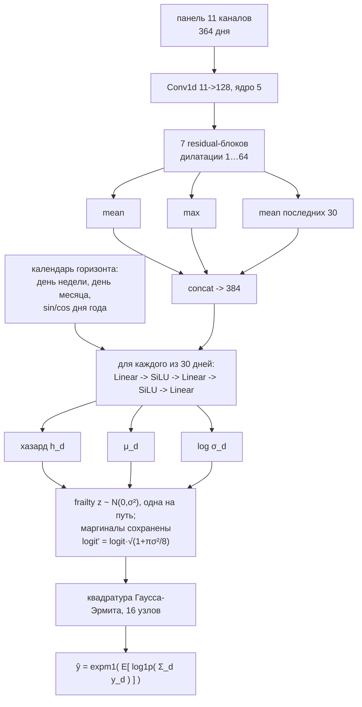

Ключ - в последнем узле: сумма берётся **внутри** логарифма. Зависимость дней внутри
окна - общая latent-frailty на клиента: один `z ~ N(0,σ²)` на путь сдвигает хазарды
всех дней, маргиналы сохраняются пробит-перемасштабированием. Параметр один, подобран
на обучающих якорях по совпадению `P(Y>0)` (0,5427 -> σ = 0,8) и заморожен.
Интегрирование frailty квадратурой Гаусса-Эрмита вместо розыгрыша дало **−0,0021**.

Модель не видит ни одного из 165 табличных признаков - только сырой дневной ряд и
календарь целевых дней.

**Событийное семейство** индексирует не календарное, а событийное время:

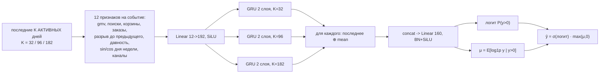

Ансамбль трёх горизонтов памяти выиграл **0,005** у одиночной LSTM - на порядок
больше, чем LSTM выиграла у GRU (0,00084). Разные горизонты памяти несут больше, чем
устройство вентилей.

**`tft_all`** добавляет три заимствования, каждое под конкретный дефект: Variable
Selection Network (свёртка мешала 11 каналов фиксированными весами независимо от
клиента), статическое обогащение через GRN вместо конкатенации, и doubly residual
stacking из N-BEATS. Маршрутизация статики работает **только с подённой головой**: со
скалярной GRN превращается в лоссовое сжатие 165 колонок в 64 и проигрывает
конкатенации на +0,0362.

### 6.4 Считывание: где терялось больше, чем находилось

Самая крупная находка проекта лежит не в архитектуре, а в том, как из обученной модели
достаётся число. Все дневные генеративные считывались симуляцией путей: 96 траекторий
на клиента. Оценка несмещённая, но шумная, а шум входит в MSE ровно: если `ŷ = θ + ε`,
то `MSE = MSE_ист + Var(ε)`, без скидок.

Точная замена - тождество Фруллани:

```
E[log(1+S)] = ∫₀^∞ e^(−t) · (1 − L_S(t)) / t · dt
```

Дни условно независимы при заданной frailty, поэтому преобразование Лапласа
факторизуется по дням, а внутреннее матожидание берётся теми же узлами
Гаусса-Эрмита. Симуляция не нужна.

| способ вывода | RMSLE | против квадратуры |
|---|---|---|
| 96 путей (то, что было) | 1,73888 | **+1,65e-03** |
| 384 | 1,73777 | +5,35e-04 |
| 1536 | 1,73729 | +5,54e-05 |
| 6144 | 1,73728 | +4,56e-05 |
| **квадратура** | **1,73723** | 0 |

Проверка жёсткая: `sd(МК − квадратура)` падает ровно как `1/√n` - 0,07176 -> 0,03580 ->
0,01789 -> 0,00898, отношения 2,005 / 2,001 / 1,992 при теоретических 2,000.
Квадратура не приближение, а точно посчитанный предел симуляции. Для сравнения:
лучшая внешняя ось проекта дала 1,96e-04 - **в восемь раз меньше**.

### 6.5 Лестница порогов: лучший одиночный вектор - не нейросеть

Оптимум RMSLE - это `E[log1p Y|x]`, и есть точный способ получить его без всякой
генеративной модели, через интеграл выживания:

```
E[S|x] = ∫₀^∞ P(S > s|x) ds ≈ Σ_m h_m(x) · Δ,   S = log1p(Y)
```

где `h_m` - обычный бинарный классификатор "превысит ли `log1p` порог `s_m`".
Никакого распределительного допущения, никакой поправки Йенсена, никакой симуляции.
Нулевая масса берётся сама собой: нижняя перекладина - это `P(Y > 0)`.

33 порога с шагом 0,25, LightGBM на тех же фичах, без единой новой модели:

| считывание | RMSLE |
|---|---|
| **интеграл выживания** | **1,73556** |
| медиана (где h пересекает 0,5) | 1,89937 |

Это лучше свёртки (1,73808) и бустинга (1,73831), т.е. вообще лучший одиночный вектор проекта.
Провал медианного считывания подтверждает диагноз: квантиль был не тем функционалом.

---

## 7. Что мы проверяли

### 7.1 Карта пятнадцати семейств

| направление | исследовано | дало выигрыш | чем закрыто или что дало |
|---|---|---|---|
| Внешние оси и зонды | 10/10 | 9/10 | девять ранних осей, четыре сработали, S/N до 13,2 |
| Считывание и функционалы | 10/10 | 10/10 | квадратура вместо Монте-Карло - 1,65e-03; лестница порогов - 1,73556 |
| Дневные генеративные | 10/10 | 9/10 | сильнейшая компонента; подённый сигнал супервизии ценен, подённая раскладка предсказания - нет |
| Стекинг и веса | 10/10 | 8/10 | 12 ограничений; ось регуляризации θ = +0,0103; в базисе найдены побитовые дубликаты |
| Табличные бустинги | 10/10 | 8/10 | костяк решения; веер из 15 целевых функций |
| Признаки и фичестор | 10/10 | 7/10 | затухания и структура нулей: 220 новых колонок почти равны всему старому фичестору |
| Событийные модели | 10/10 | 5/10 | multi_full прошёл порог допуска; LSTM развернула знак в ансамбле |
| Контрастивное обучение | 8/10 | 4/10 | CoLES +0,047; диагноз - глобальный pretext на локальной задаче |
| Энкодеры и attention | 10/10 | 3/10 | выигрыш во входе, не в голове; малые веса в стеке |
| Ось обучения | 10/10 | 0/10 | якоря, взвешивание, форма штрафа: общая ось дала t = −0,57 |
| Шум и усреднение | 10/10 | 0/10 | усреднение сидов опровергнуто дважды; TTA после очистки 0,68 шума |
| Ритм и календарь | 9/10 | 0/10 | недельный ритм реален, но надёжность оценки 0,085 |
| Foundation-модели | 10/10 | 0/10 | два семейства, пять размеров, три режима, везде с контролем |
| Сегментация и кластеры | 9/10 | 0/10 | пять проб, три экрана - нули |
| Декомпозиция цели | 9/10 | 0/10 | клики×конверсия, каналы, коэффициент, отток, праздники - шесть закрытий |

### 7.2 Закрытые направления

Каждая строка - измерение с контролем, а не впечатление.

| идея | результат |
|---|---|
| Граф user-user, скрытые факторы | +0,00037 при полосе +-0,0004; случайные проекции +0,00006, перемешанные −0,00013 |
| Кластеризация: сегментные веса стека | перенос даёт только уровень, с общей константой - ноль (3 из 3 знаков) |
| Тёплый специалист в бленде | +0,0022 сверх аффинного, но второй пул с другим сидом даёт +0,0029 |
| Цель как коэффициент к прошлому месяцу | хуже на всех смещениях, и на тёплых тоже |
| Цена клика как модель | низкий RMSLE на кликах, развал на конверсии; закрыто тремя проверками |
| Random Forest / Extra Trees | тот же кластер, что бустинги, g = 0,992–0,994 |
| Генеративная голова у энкодера | +0,00047, то есть ноль: три четверти отставания давал вход, а не голова |
| Предобучение на недельном горизонте | +0,00200 сверх равного бюджета |
| Обрезка длинных окон истории | хуже на 0,0008–0,0011 |
| Многогоризонтная супервизия дневной модели | хуже на 0,0018 |
| Явный признак апрельского перелома | ноль |
| Канальная декомпозиция (два стека / две головы) | сборка из каналов 2,48 против 1,77; ICC доли каталога 0,22 |
| Квантильное выравнивание распределений | арифметика: `b = 1,4224` -> 1,7844. Закрыто без эксперимента |
| Рекурсивное округление / порог в ноль | цель не квантована; вред `h²/12` предсказан и замерен, рекурсия идемпотентна |
| Отдельная модель оттока | AUC 0,851, но зануление ≈ 0, добавка сверх перекалибровки 1,66e-05 |
| Праздничная надбавка как ось | +8,3% за окно, но однородна (согласованность половин 0,0196), уже в уровне |
| Укрупнение корзин генеративной головы | 1,73823 / 1,73964 / 1,74375 при 1/3/5 днях - монотонно хуже |
| Сдвинутые копии окон и когортные агрегаты | 1309 колонок дают 1,73796 против 1,73698 - переобучение на нашем масштабе |
| Изотоника лестницы порогов | чинит калибровку идеально, скор хуже на 3,3e-04 |
| Маска паддинга из PatchTST-FM | три конфигурации, от +0,00276 до −0,00010 |
| Обучение прямо под метрику через квадратуру | +4,09e-03: подённое правдоподобие даёт в 30 раз больше супервизии |
| Moirai-1.1-R-large | ствол проигрывает контролю на +0,00834, zero-shot 1,88394 |
| Toto 2.0 zero-shot | 1,958 против 1,724; `P(Y>0)` 0,997 против 0,583 |
| Toto 2.0 как предобученный ствол | сигнал есть (отрыв 0,011), потолок 1,766 против 1,738 |
| Chronos-2 (три режима) | 1,883 / 1,920 / 1,904 против 1,748 |
| Chronos-2 как ствол | 1,77785 против 1,77719 у случайной проекции - проигрыш контролю |
| Условная диффузия (TSDiff-подход) | 1,81944 с гейтом против 1,73808 |
| TimeDiffusion | одна модель на один ряд; 250k рядов по 409 точек - неподъёмно |
| LSINet | закрыт аналитически: выигрыш в эффективности, не в точности |
| SARIMA на дневном ряду | 95% нулей, предпосылки нарушены; классика прерывистого спроса 1,8405 |
| N-BEATS целиком | базис тренда/сезонности не для прерывистых рядов; взят только residual stacking |
| Контрастив над табличными колонками | зонд 1,787–1,829 против 1,737 у CoLES на сырых рядах |
| Слияние энкодера и событийной LSTM | хуже лучшего одиночного ствола на 0,00025 |
| kNN как компонента стека | 0,980 ортогональности - рекорд проекта, но отставание 0,025 |
| Трансформер над событиями | выигрывает по скору (−0,00245) и НЕ даёт ортогональности |
| Sparsemax вместо softmax в VSN | +0,00074: мешает нормировка поперёк переменных, а не мягкость |
| Мультипликативная обусловленность (FiLM) | разваливает свёрточный ствол: 2,02 против 1,744 |
| Выравнивание по дню недели | t = +0,60 |
| Жизненный цикл и концентрация | t = +0,78 |
| Событийная нормировка как ось | S/N 3,3, выигрыш 1,5e-05 - переиндексация того же |
| HMM, GMM-frailty, блочная память | все три закрыты, и по разным причинам |
| База активности в контексте | +1,24e-03 локально на шести стволах - самый воспроизводимый эффект проекта; выравнивание с остатком стека НОЛЬ |
| Вентиль свежесть × всплесковость | +6,7e-04 на трёх сидах (t = 2,34), в стеке ноль |
| CV промежутков в контексте | +2,7e-04 локально, corr вектора 0,99767 |
| TTA (усреднение по видам входа) | после очистки 0,68 шума сидов - ниже порога различимости |
| Усреднение по сидам | опровергнуто и на лидерборде, и на отложенных клиентах |
| Плотность якорей | при выровненном числе шагов градиента корреляция с "сильнейшим зондом кампании" = 0,04 |
| Ось обучения (якоря, веса, штраф) | θ = −0,00419, t = −0,57 |
| Квадратура вместо Монте-Карло в готовом стеке | теория обещала +2,3e-05, факт −3,9e-05 |

### 7.3 Два закона, выведенные во время решения контеста
1) Локальное качество компоненты и её польза стеку не связаны. `tft_all` с архитектурным преимуществом, подтверждённым на двух
протоколах, вошёл в стек с весом −0,144, потому что его `g = 0,99655`. А
`event_multi`, худший локально из четвёрки, получил +0,157 при `g = 0,99336`. Самый
воспроизводимый локальный эффект проекта (база активности в контексте, +1,24e-03 на
шести стволах, знак не сорвался ни разу) дал на лидерборде ровно ноль.

2) Замена компоненты на "улучшенную" без перенастройки весов ломает подгонку,
которая на неё опиралась.** Так провалились замена дневных рук, замена считывания
квадратурой и подстановка усреднённых по сидам версий. Механизм один: стек
использует ошибку компоненты, а не её точность.

Полезно и то, чего эти законы стоили в измерениях: иерархия рычагов. Правки
модели надо мерить не скором, а сдвигом вектора.

| рычаг | corr между вариантами |
|---|---|
| смена сида | 0,999 |
| функция потерь головы | 0,9988 |
| число обучающих якорей | 0,997 |
| смена архитектуры (стволы, VSN, residual) | 0,993–0,996 |
| смена семейства представления (событийное) | 0,988 |
| тип модели (инстансный kNN) | 0,980 |

Вход двигает ошибку на порядок сильнее головы. И ортогональность нельзя получить
ухудшением (модели на сыром `y` имеют самую низкую корреляцию с базой во всём веере
целевых функций и дают в сто раз меньше вклада - они целятся в `E[Y]` вместо
`E[log1p Y]`, вектор ошибки смотрит в другую сторону, но эта сторона состоит из
ошибки, а не из сигнала)

### 7.4 Правила, оплаченные ошибками

* **Порядок якорей внутри эпохи стоит 0,017** у sequence-моделей. Эпоху надо
  заканчивать на самом свежем якоре, иначе OneCycle оставляет модель на старых данных.
* **Валидация не пригодна для калибровки.** Аффинная поправка с якоря 378, применённая к
  финальному, ухудшает на 0,0067. Шесть независимых подтверждений.
* **Считать ковариацию надо прямо из файлов**, а не по формуле: нуль пробы зависит от того,
  перевыравнивается ли уровень (дисперсия возмущения `w·c²` против `w(1−w)·c²`).
* **Утечка через центрирование.** Среднее по клиенту за всю историю включает целевое
  окно. Первая версия одного из проб дала −0,0198 и была целиком утечкой.
* **Сдвиг окна это не сдвиг якоря.** Двигать окно, оставляя метку на месте образует утечку.
  Аугментация сдвигами означает новые якоря: окно и метка едут вместе.
* **Статистики нормировки принадлежат протоколу, а не набору якорей.** Нарушение
  стоило 0,10 скора и было утечкой.
* **Отрицательный старт окна.** При якоре 348 и контексте 512 индекс уходит в −163, и
  numpy молча возвращает 103 дня вместо 512.
* **Выводы о предобученных моделях нельзя делать на малой версии.** На 22m ствол Toto
  проигрывал случайной проекции, на 313m и 1B - обходит её.
* **Слияние стволов требует сопоставимого качества.** Разнообразие представлений
  необходимо, но не достаточно: ствол, отстающий на 0,0035, испортил слияние.
* **Перед сабмитом считать S/N против потолка шума.** S/N > 2 - выигрыш переживёт
  приват; около 1 - половина подгонка; ниже - чистый шум.

Отдельно стоит записать метрологическую поправку, которая переоценила все прошлые
выводы: эталон шума сидов был занижен в полтора раза. Прямой замер на паре
одинаковых конфигураций (совпадают якоря, эпохи, штраф, веса; различается только сид)
дал стандартное отклонение разности 0,14932 против принятых 0,095, подтверждено на пяти независимых
компонентах. Все оценки вида "правка даёт 1,3 шума сидов" надо делить примерно на
1,57.
---

## 8. Точность воспроизведения

Прогон с режимом `--cached`, сверка с эталонными CSV:

| результат | расхождение (RMS в лог-шкале) | corr с эталоном |
|---|---|---|
| опора `stack_v12` | 4,986e-02 | **0,999535** |
| вершина `stack_v23_dir` | 4,304e-02 | **0,999654** |
| ступень `stack_v13` | 6,523e-02 | **0,999202** |

Направления собираемых проб, измеренные против эталонных: `q99` 0,9617,
`nosm` 0,8734, `quad` 0,8657, `operator` 0,8412. Остальные пять берутся готовыми
векторами и здесь не оцениваются.

По ступеням видно, что лестница частично сама себя исправляет: ошибка опоры не
накапливается, а гасится, потому что каждая ступень заново выравнивает уровень к `E[log1p Y] = 2,3284`, а направление нормируется и ортогонализуется к
текущей опоре.

| ступень | расхождение | corr с эталоном |
|---|---|---|
| `stack_v12` (опора) | 4,986e-02 | 0,999535 |
| `stack_v14` | 6,25e-02 | 0,999266 |
| `stack_v16` | 4,93e-02 | 0,999545 |
| `stack_v17` | 4,00e-02 | 0,999701 |
| `stack_v18` | 4,12e-02 | 0,999683 |
| `stack_v19` | 3,85e-02 | 0,999724 |
| `stack_v20` | 3,85e-02 | 0,999724 |
| `stack_v21` | 3,85e-02 | 0,999724 |
| `stack_v22` | 3,84e-02 | **0,999726** |
| `stack_v23_dir` | 4,30e-02 | 0,999654 |

Сверка включается переменной окружения `ECUP_REF` - каталогом с эталонными CSV.
Без неё пакет не читает ничего за пределами собственной директории.

Ошибка опоры входит в каждую ступень. Опора **собирается солвером всегда** - готовым
файлом она не берётся ни в одном режиме.

---

## 9. Состав репозитория

```
run.py                        сквозной прогон: данные -> CSV
README.md                     этот файл

components/common.py          панели, фичестор, протокол валидации
components/panels/            17 панелей из train.parquet (побитово)
components/basis/             21 скрипт компонент базиса опоры
components/models/            8 скриптов векторов для проб
components/probes/            настоящие скрипты проб + build_probe.py
components/stack/             солвер опоры

data/lookup.tsv               19 замеров лестницы
data/basis_scores.tsv         26 замеров компонент базиса
data/basis_plan.json          компоненты базиса и их генераторы
data/train_plan.json          скрипты векторов для проб
data/ladder_spec.json         ступени лестницы
data/probe_recipes.json       настоящие конструкции проб

vectors/                      готовые векторы для --cached
eda/chartdata.json            свод разведочного анализа
eda/make_charts.py            строит графики этого README
eda/*.svg                     графики
```

Цепочка в режиме `--train`:

```
train.parquet
  -> components/panels/     17 панелей
  -> components/basis/      21 скрипт -> компоненты базиса
  -> components/stack/      солвер по data/basis_scores.tsv -> опора stack_v12
  -> components/models/     8 скриптов -> векторы для проб
  -> components/probes/     зонды своими конструкциями
  -> run.py                 9 ступеней -> stack_v23_dir.csv
```
